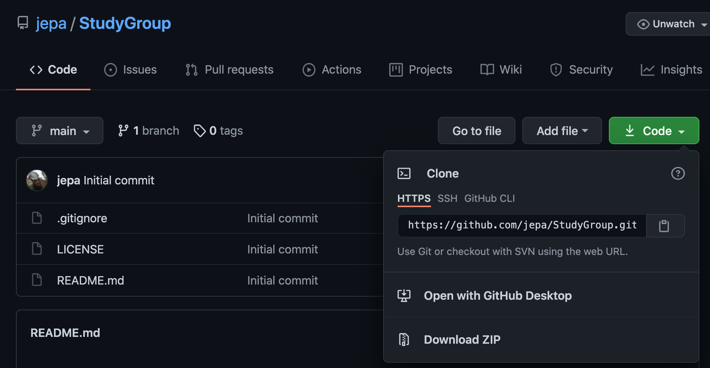
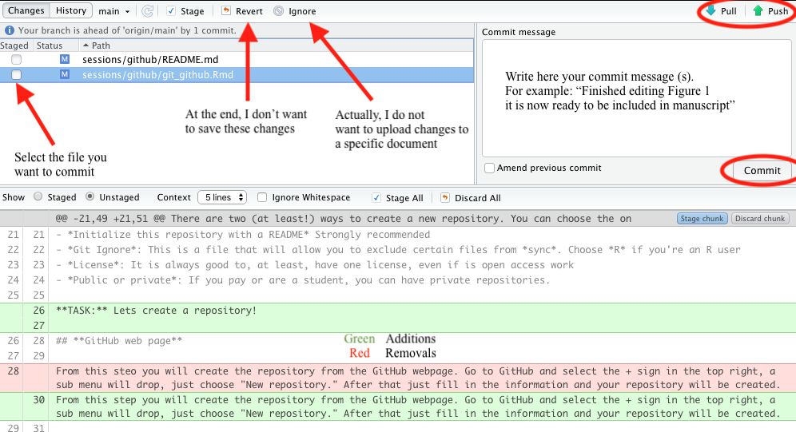
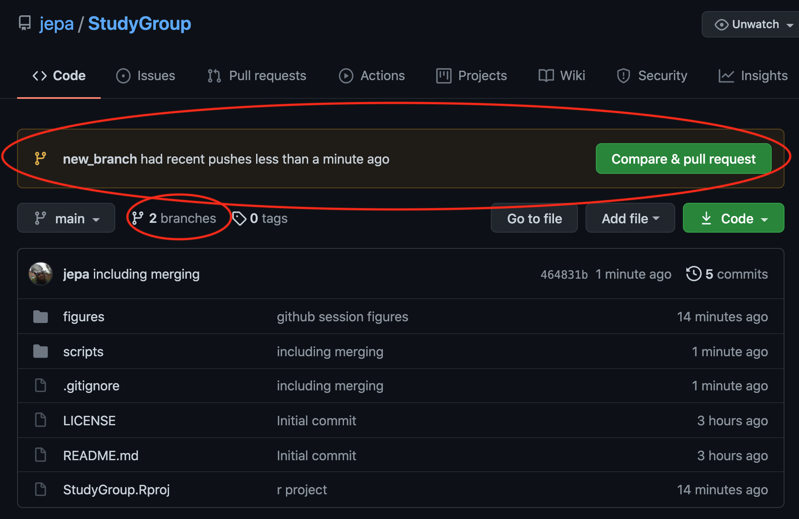
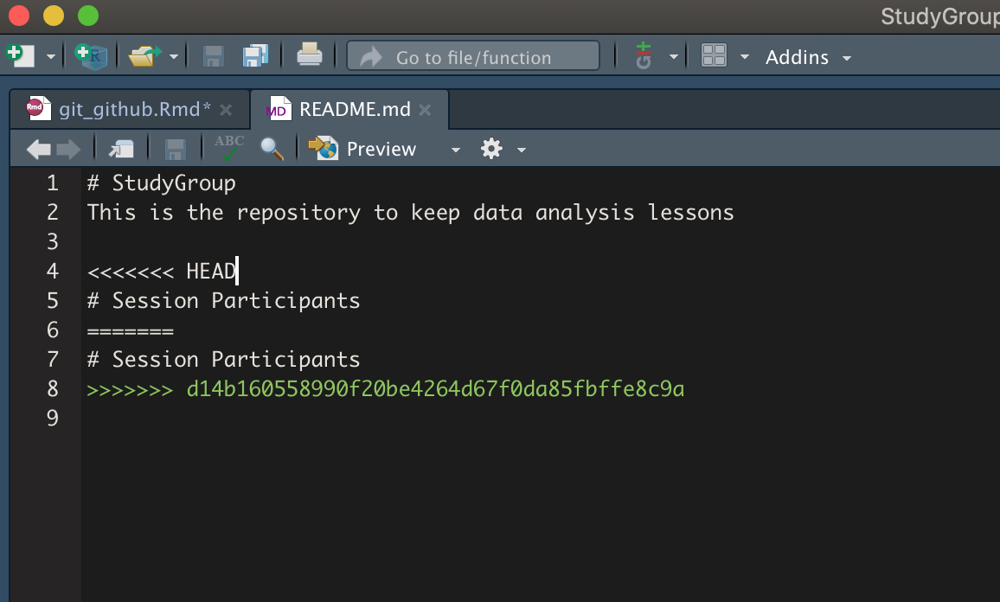

# Crie um novo repositório

Existem duas (pelo menos!) maneiras de criar um novo repositório. Você pode escolher aquele com o qual se sente mais confortável! No geral, você terá concluído o seguinte:

- *Nome*: você quer que seja curto e direto
- *Descrição*: é bom ter uma breve descrição do que é o repositório
- *Caminho Local*: É aqui que você salvará o repositório em seu computador
- *Inicialize este repositório com um README* Altamente recomendado
- *Git Ignore*: Este é um arquivo que permitirá excluir certos arquivos do *sync*. Escolha *R* se você for um usuário R
- *Licença*: É sempre bom ter pelo menos uma licença, mesmo que seja um trabalho de acesso aberto
- *Público ou privado*: Se você paga ou é estudante, pode ter repositórios privados.

**TAREFA:** Vamos criar um repositório!

## **Página do GitHub**

A partir desta etapa, você criará o repositório na página da web do GitHub. Vá para o GitHub e selecione o sinal + no canto superior direito, um submenu aparecerá, basta escolher “Novo repositório”. Depois disso basta preencher as informações e seu repositório estará criado.

### Vincule o repositório ao R-Studio.

Depois de criar o repositório, você terá que vinculá-lo ao R-Studio para poder controlar seu fluxo de trabalho. A maneira como você cria o repositório marcará a maneira como você se conecta. Se você criou o repositório no site, siga estas etapas para vinculá-lo ao R:

1.- Abra o R-Studio, vá em “Arquivo” -> “Novo Projeto”. Alternativamente, no canto superior direito aparecerá (deveria dizer) "Projeto (Nenhum)", a primeira opção ao clicar deve ser "Novo Projeto...". Uma janela pop-pit deve aparecer. Vá em frente e clique em "Controle de versão" e depois em "Git". Você deve chegar ao terceiro painel abaixo.

2.- Uma vez lá, vá até a tela inicial do seu repositório no navegador e clique no botão verde que diz “Código”. Uma janela pop-up deve aparecer. Copie o link "HTTPS" (na imagem abaixo, o link seria `https://github.com/jepa/StudyGroup.git`) 

3. - Volte ao R-Studio e cole o link no "Repository URL:" da janela do New Project Wizard. O *Nome do diretório do projeto* mostrará automaticamente o nome do seu repositório. (sugiro que você mantenha o mesmo). Por fim, selecione o subdiretório em seu computador onde você manterá o repositório. Clique em "Criar Projeto" e deixe a mágica começar...

## **GitHub Desktop.** 

Esta pode ser a maneira mais direta de criar um novo repositório em seu computador. Se você baixou o [gitHub Desktop](https://desktop.github.com/), vá para `Arquivo` -> Novo Repositório, uma janela `Criar um Novo Repositório` como a abaixo deve aparecer.

### Vincule o repositório ao R-Studio.

Agora vamos ao R-Studio para vinculá-lo ao novo repositório em uma única etapa:

1.- Abra o R-Studio, vá em “Arquivo” -> “Novo Projeto”. Alternativamente, no canto superior direito aparecerá (deveria dizer) "Projeto (Nenhum)", a primeira opção ao clicar deve ser "Novo Projeto...". Uma janela pop-pit deve aparecer. Vá em frente e clique em "Diretório Existente" e depois em "Navegar". Agora localize o Repositório que você criou no GitHub Desktop e pronto!

Independentemente do método que você escolher. Seu projeto R-Studio deve ser parecido com isto:

# Unig GitHub

## Modo solo

Tecnicamente falando, o GitHub foi projetado para trabalho colaborativo. No entanto, também acho SUPER útil para trabalhos solo. Além disso, quanto mais você trabalhar nisso como usuário solo, mais preparado estará para quando precisar colaborar. Nesta seção, cobriremos os fundamentos do controle de versão e algumas das *ferramentas* que o GitHub tem a oferecer, como *Issues*, *Branches* e *web page*. 

###  Commit, push, pull, repeat.

Esta é a base do controle de versão. Essas etapas são responsáveis por salvar seu fluxo de trabalho, carregá-lo no repositório do projeto e baixá-lo para o seu computador, ou seja, sincronizar. Então, agora que criamos nosso primeiro repositório podemos começar a trabalhar nele!

**TAREFA:** Vamos criar um arquivo e enviá-lo!

Abra um script *R* e escreva o que quiser nele.  Depois de fazermos algumas alterações no arquivo e salvá-las, você as verá refletidas em seu ambiente `Git`. Assim que terminarmos esta pequena tarefa, devemos `Commit` nossas alterações em nosso *computador local*. Lembre-se de escrever uma mensagem curta, mas informativa!

Depois de fazermos os Commits que desejamos para o dia, podemos enviá-los para o Repo (também conhecido como mesclá-los). Agora vá para o seu repositório online e você verá seu commit refletido na página de projetos. 

## Modo colaborativo, ATIVADO! 

Agora que conhecemos a base, podemos entrar no modo colaborativo. Para colaboração, as etapas são basicamente as mesmas, com algumas etapas extras.

**TAREFA:** Vamos todos colaborar no projeto `StudyGroup`.

### Bifurcação!

Primeiro, quando estamos colaborando, precisamos `fork` o repositório para o nosso gitHub. Vá para a página web do nosso StudyGroup (https://github.com/jepa/StudyGroup) e clique em `Fork` no canto superior direito. Isso basicamente criará nossa própria versão do projeto. Note que meu caminho inicial diz `jepa/StudyGroup`, isso significa que o repositório pertence ao usuário "jepa", o que diz o seu? 

Agora vamos praticar e abrir o repositório no seu R-studio. Depois de abri-lo, vá para o arquivo README e adicione seu nome em “Participantes da sessão”, confirme e envie sua alteração. 

### Confirmação de solicitação pull

Assim que terminarmos nosso trabalho, queremos mesclá-lo com o branch principal do projeto para que todos os seus colaboradores possam ver o que você fez. Na página do github podemos ver que o arquivo README do nosso repositório agora tem nosso nome. Vá em frente e clique em `Pull request` e no botão verde `New pull request`. Você deverá ver a seguinte janela;

No topo vemos o branch em que estamos trabalhando e o branch com o qual queremos fazer a fusão. Também deve dizer "Capaz de mesclar" em verde. No painel do meio ele mostra quais arquivos você modificou (neste caso o arquivo `README` deve aparecer) e na parte inferior a modificação real.

Agora que temos certeza de que é isso que queremos, clicamos em "*Create a Pull request*". A próxima janela nos mostrará um resumo da solicitação *pull.* Observe que ele abre como um modo de “chat” onde os usuários podem comentar, aceitar ou rejeitar a solicitação.

### Mesclando 

Agora, como sou o único *proprietário* do repositório, sou o único com o poder de *aceitar* seu `Pull Request`. Observe que o repositório agora mostra "1" `Pull request` e quando eu o abro, chego a uma página semelhante à sua. A principal diferença é que posso `Mesclar pull request`.   

## Ferramentas e práticas recomendadas do gitHub

### O arquivo README.

Os arquivos `README.md` são uma das ferramentas mais úteis do GitHub. Esses arquivos são mostrados diretamente no repositório e podem servir de orientação para o seu repositório. Vamos reservar um momento para escrever nosso `README.md`. Aqui estão alguns exemplos; [FishForVisa](https://github.com/jepa/FishForVisa), [OHI-Science](https://github.com/OHI -Ciência/treinamento em ciência de dados).

**TAREFA:** Reserve algum tempo para preencher nosso arquivo `README.md`. Lembre-se, toda vez que você fizer uma alteração no repositório, você precisará "confirmar" essa alteração

### Problemas

Quantos de vocês comentaram em seu código coisas como `# Altere este valor quando novos dados chegarem "` e então se esqueceram completamente disso? Bem, a guia *Problemas* está aqui para você! Basicamente, documentamos todos os problemas que encontramos em nosso código, independentemente de termos lidado com eles ou não, os problemas tornam-se um aspecto fundamental dos projetos colaborativos e o intercâmbio entre os colaboradores permanece lá.

#### Configurando uma planilha de problemas

Eu gosto de ter uma forma padronizada de apresentar as questões. Para isso, vá até a aba *Insights*, selecione *Comunidade* no menu esquerdo e clique em `Adicionar` *Add Issues templates*. Depende de qual é o repositório, você pode escolher entre algumas opções. Para meus projetos pessoais eu apenas uso uma modificação do `Modelo de bug`. 

**TAREFA:** Criar um modelo de problema para seu repositório

#### Crie um novo problema

Vá até a aba *Problemas* e clique no botão verde "Novo problema". Algumas coisas na questão:

- **Destinatários**: Ao colaborar, você pode atribuir colaboradores específicos para problemas específicos. 
- **Rótulos**: uma ótima maneira de acompanhar problemas semelhantes (por exemplo, codificação, dados, função)

**TAREFA:** Criar um problema com um rótulo. Responda a esse problema e feche-o.

### Branches

Branches são uma forma de explorar partes do seu projeto sem alterar o produto principal. Pense desta forma. 

Vamos imaginar que você acabou de terminar toda a análise do seu artigo no branch `master` (todos os projetos começam neste branch). Análises, resultados, números, tudo muito bem feito. Você envia o artigo para seus coautores e um deles pergunta o que aconteceria se, em vez de calcular a média dos resultados em 10 anos, você calculasse a média em 20 anos. Uma tarefa relativamente grande que levará algum tempo para ser computada. 

No calor do momento você esquece as ramificações, vai para o seu script de análise e comenta algumas partes do seu código, altera partes do código, altera seus gráficos, eixos e todas as travessuras. Você obtém os resultados finais e os apresenta aos coautores. Adivinhe, o coautor decidiu que a análise original estava correta. 

Neste ponto, você fez tantas alterações no script de análise que leva uma semana para descobrir onde você estava na análise original. Além disso, você não pode simplesmente voltar ao controle de versão porque fez alterações substanciais no manuscrito em paralelo e as perderia, meu Deus!

Em um universo paralelo, você criou um novo branch chamado `time_test` para trabalhar nesta solicitação. Neste universo, seu coautor e você decidiram que esta é uma abordagem melhor. Neste caso você faz um `Pull Request` e eventualmente *merge* o branch `time_test` com o `master`. Agora, seu branch `master` inclui o script de análise do `time_test` e as alterações em seu arquivo de manuscrito não são perdidas.

#### Nova *branch*

Para criar uma nova branch você tem duas opções. No R-Studio vá até a aba `Git` e clique naquele "ícone engraçado roxo". Uma janela pop-out aparecerá, basta digitar o novo nome da filial e pronto. Observe que o projeto mudará imediatamente para trabalhar nesse branch.

**Nota**: O R-Studio sempre exibirá o nome do branch em que você está trabalhando ao lado do ícone engraçado. Para alternar entre ramificações basta clicar no nome e escolher aquela em que deseja trabalhar. Sempre comprometa seu trabalho antes de mudar de ramo. 

#### Juntar o *branch*

Se você está pronto para tornar os documentos trabalhados na ramificação alternativa os principais do seu projeto você precisa mesclar a ramificação alternativa com a principal. A fusão de ramificações é uma etapa bidirecional: i) há uma solicitação pull e ii) confirmação de mesclagem.

##### Branch a partir de uma solicitação *pull*

Você pode ver quantas ramificações possui na página github.com do seu projeto. Além disso, o github criará uma mensagem de alerta quando alguém (você ou um colaborador) enviar algum trabalho para um branch alternativo.

Você pode simplesmente clicar em "*Compare & pull request*", ou, em `branches` onde você verá todos os branchs ativos, os commits que cada um possui, e um botão que diz "New pull request" (se você clicar no nome do branch, você será levado ao projeto dentro desse branch).

Uma vez na seção de solicitação pull, você precisará escrever um título para a solicitação pull, uma descrição e enviar a solicitação pull. O Github procurará automaticamente por problemas de mesclagem (por exemplo, se houver várias versões do mesmo documento trabalhando ao mesmo tempo nas mesmas partes) e se estiver tudo bem, você terá "solicitado uma mesclagem".

##### Juntando os Branch

Para que o branch seja mesclado, alguém deve clicar em `Merge pull request`, escrever um comentário e aceitar a mesclagem. Feito isso, você pode apagar o galho clicando no ícone da lixeira. Se você optar por não mesclar, um botão vermelho aparecerá e uma mensagem "Excluir ramificação" também. Ao final, você terá um controle de versão documentado de suas solicitações pull.

**TAREFA:** Criar uma nova ramificação, fazer algumas alterações em um documento existente e mesclar essa ramificação com a principal.

### Página do projeto

O GitHub tem uma opção interessante que permite que você tenha uma página da web baseada em `rmarkdown` para o seu projeto. A melhor parte é que com alguns cliques você obtém um belo modelo!

**TAREFA:** Criar uma página web para nosso projeto

Vá para a página principal do repositório que você criou (não `StudyGroup`). Vá em *Configurações* e clique em *Páginas* no menu esquerdo (o último). Em `Fonte` selecione "principal". Serão apresentadas duas opções:

- `root`, esta opção é a mais básica e usará o arquivo `README` como base da página web.

- `docs`, esta opção criará uma página web em uma pasta chamada `docs`. Você precisará criar a pasta primeiro.

## Melhores práticas

Observe que esta é uma lista que reflete principalmente as sugestões do [GitLab](https://about.gitlab.com/topics/version-control/version-control-best-practices/).

- Faça pequenas alterações incrementais
- Mantenha os commits atômicos
- Desenvolver usando ramificações
- Escreva mensagens de commit descritivas
- Obtenha feedback por meio de revisões de código
- Identificar uma estratégia de ramificação

# O conflito de atração... 

Em algum momento todos nós teremos aquele conflito de fusão que pode rapidamente se tornar um pesadelo... Este é normalmente o caso quando você **ESQUECEU** de `puxar` *antes* de começar a trabalhar em um documento que outra pessoa já trabalhou.

Etapa um: NÃO FREQUEIE. Parece horrível e cheio de palavras como *trabalho remoto*... *avanço rápido*... etc. Mas a verdade é que, uma vez que você descobre isso, não é *tão* ruim. O GitHub tem uma maneira de informar onde estão as versões correspondentes. Depois de fechar a janela, clique no(s) documento(s) laranja(s).

Neste caso, parece que também alterei o arquivo `README` e criei um conflito ao mostrar o exemplo colaborativo. Isso também refletirá no meu arquivo `README.md`.

Este é um caso fácil, então posso simplesmente apagar uma das linhas repetidas, corrigir o problema, `commit` e então `push` o repositório.

